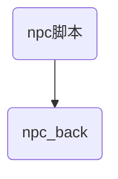

# 19-8-20 星期二

1. 地图编辑
    - 生成DB必须勾选map选项 地图才会上传到服务器
    - 服务器上有地图信息,添加地图后找不到地图信息,无法跳转,但没有报错
     解决方法:一次添加多张地图选可以用的使用
    有很大可能都是因为使用的资源不正确
    - 小地图未显示.
     解决办法:更换地图资源

    - 副本脚本.副本的生命周期方法:
    1. create()
    2. leave()
    3. destory()
    - 物品相关脚本:

------
2. 刷新怪物


------
3. 怪物编辑

图标流程
     
------
  
```mermaid
graph TB
F{system}-->B[icon_show]
B[icon_show]-->E[倒计时]

A---C(Cat)
B.->D((Dog))
C==喵==>D
```
------

